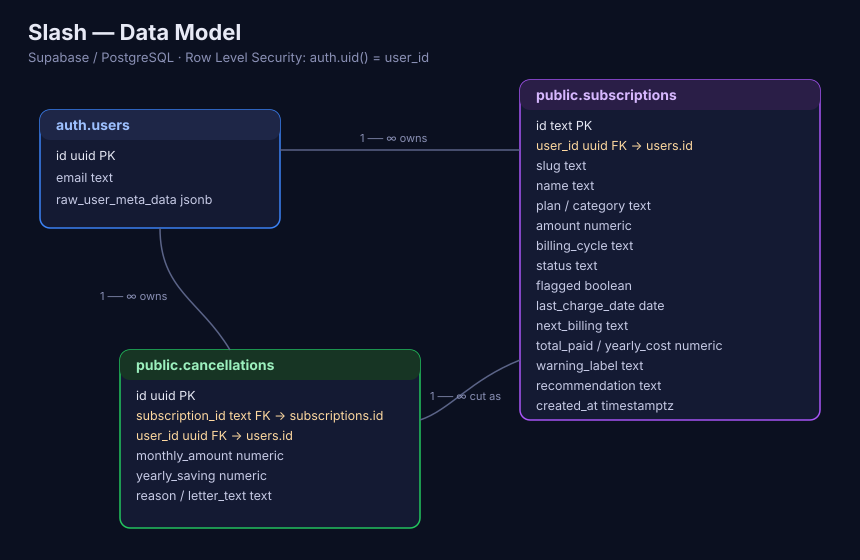

# Slash — Cut your hidden expenses

Slash is a full-stack web app that reads a user's bank statement, automatically
detects recurring subscriptions, flags **duplicates, unused services, and price
hikes**, and helps the user cancel them — tracking every cancellation and the
money it saves.

> **Live demo:** https://slash-app-tau.vercel.app
> **Demo account:** `demo@slash.app` / `DemoPass123`



---

## The problem

The average household quietly leaks money through subscriptions it forgot about:
a second cloud-storage plan, a design tool from a project that ended, a streaming
service nobody watches, an app that silently raised its price. Israeli bank and
credit-card statements make this **hard to see** — charges are scattered across
months, named with cryptic merchant codes, and split between accounts.

People "solve" this today by **scrolling their statement in the bank app**,
**exporting to Excel and eyeballing it**, or **just not bothering** — and keep
paying. Slash turns that manual hunt into a 60-second, automated review.

## Who it's for

Israeli consumers (₪, Hebrew-aware statement parsing) who pay for several digital
subscriptions and want to stop overpaying — without handing their bank login to a
third party. The whole detection step runs **locally in the browser**; the file
never leaves the device.

## Competitors & differentiation

| Alternative | What it is | Why Slash is better |
| --- | --- | --- |
| **Excel / manual review** | Export statement, sort, scan by eye | Slash auto-groups by merchant, detects recurrence + duplicates, and computes yearly waste instantly |
| **Doing nothing** | The default | Slash surfaces the exact ₪/year you'd save, turning vague guilt into one-click action |
| **Bank "subscriptions" tabs** | Bank-locked list of standing orders | Slash works across **any** bank export, catches card-based subscriptions banks miss, and flags duplicates *across* services (e.g. iCloud + Google One) |
| **Rocket Money / Truebill (US)** | Subscription manager + negotiation | Those are US-only and require linking bank credentials. Slash is ₪-native and privacy-first (local parsing), no bank login required |

**Slash's edge:** privacy-first local parsing, Hebrew-statement aware, cross-service
duplicate detection, and an AI recommendation per subscription — wrapped in a
polished, mobile-first product.

---

## Core flow (what to test)

1. **Register / sign in** (`/register`, `/login`) — real Supabase auth.
2. **Onboarding** → **Upload** (`/upload`) — drag in an Excel/CSV, or click
   **Download demo statement** for a realistic example. (New accounts are also
   pre-seeded with sample subscriptions so the dashboard is never empty.)
3. **Processing** → **Dashboard** (`/dashboard`) — monthly spend, potential
   yearly savings, and your subscriptions.
4. **Subscription detail** (`/subscription/:id`) — usage, next billing, yearly
   cost, and a **Slash AI recommendation**.
5. **Cancel** → **Confirm** (`/review`) — the subscription is marked cut and
   written back to Supabase, plus a row in the `cancellations` ledger.
6. **Savings report** (`/savings`) and **Settings** (`/settings`, with sign-out
   and "reset data").

---

## Tech stack

- **React 19 + Vite** (JavaScript)
- **React Router v7**
- **Supabase** — Postgres database, Auth, and an Edge Function
- **Custom CSS** with design tokens (no Tailwind) · **Bricolage Grotesque** + **Hanken Grotesk**
- **xlsx (SheetJS)** — local, in-browser statement parsing
- **sonner** — toasts · **Radix UI** primitives

## External services & integrations

| Service | Type | What it's used for |
| --- | --- | --- |
| **Supabase Auth** | Authentication | Email/password sign-up & sign-in; session management. Google/Microsoft/Facebook buttons call `signInWithOAuth` (enable the provider in Supabase to activate). |
| **Supabase Postgres** | Database / API | Stores each user's `subscriptions` and `cancellations`, fetched via the auto-generated REST API, protected by Row Level Security. |
| **Supabase Edge Function (`recommend`)** | Server-side logic | Calls the **Anthropic Claude API** to generate a per-subscription recommendation. The API key lives only in the function's environment — never in the browser bundle. Falls back to bundled text if unset. |
| **Anthropic Claude API** | External AI API | Generates the "Slash AI recommendation" text (via the Edge Function). |
| **Google Fonts** | Assets | Bricolage Grotesque, Hanken Grotesk, Material Symbols. |

## Data model (ERD)

See **[docs/erd.md](docs/erd.md)** for the full diagram, column types, and RLS
policies. In short:

```
auth.users (1) ──< subscriptions (∞)
auth.users (1) ──< cancellations (∞)
subscriptions (1) ──< cancellations (∞)
```

Both `public` tables enforce owner-only access via `auth.uid() = user_id`.

---

## Run locally

```bash
npm install
cp .env.example .env.local   # then fill in your Supabase URL + anon key
npm run dev                  # http://localhost:5173
```

### Environment variables

| Var | Where to find it |
| --- | --- |
| `VITE_SUPABASE_URL` | Supabase → Project Settings → API → Project URL |
| `VITE_SUPABASE_ANON_KEY` | Supabase → Project Settings → API → `anon` public key |

The anon key is meant to be public; access is guarded by RLS, not by hiding the key.

### Database setup

Run the migrations in [`supabase/migrations`](supabase/migrations) in order, in the
Supabase **SQL Editor** (`0001` → `0004`). Then, under **Auth → Providers →
Email**, disable "Confirm email" for the course demo so accounts can sign in
immediately, and create the demo account (`demo@slash.app` / `DemoPass123`) via
the app's Register screen.

### AI Edge Function (optional but recommended)

```bash
supabase functions deploy recommend
supabase secrets set ANTHROPIC_API_KEY=sk-ant-...
```

Without it, the app shows the bundled rule-based recommendations instead of live AI.

## Deploy to Vercel

1. Push to GitHub and **Import** the repo in Vercel (framework auto-detected as Vite; `vercel.json` adds SPA rewrites).
2. Add the two `VITE_SUPABASE_*` env vars in **Vercel → Settings → Environment Variables**.
3. In Supabase **Auth → URL Configuration**, add your Vercel URL to the allowed redirect URLs.
4. Deploy, then open the URL in a private window to confirm the full flow works.

## How this was built (Vibe Coding)

Slash was built iteratively with AI coding tools: a Stitch design export drove the
visual system (mirrored as design tokens in `globals.css`), and the React app,
Supabase schema, RLS policies, and Edge Function were generated and refined
through prompt-driven development.

## Project structure

```
src/
  context/SubscriptionsContext.jsx   ← auth session + per-user data, seeding, cancel
  lib/supabaseClient.js, lib/recommend.js
  utils/parseStatement.js            ← in-browser Excel/CSV parsing (Hebrew-aware)
  data/subscriptions.js              ← bundled starter set + supported banks
  layouts/  components/  pages/      ← UI (each component in its own folder + .css)
supabase/
  migrations/                        ← 0001–0004 (schema + RLS)
  functions/recommend/               ← Claude-backed Edge Function
docs/
  erd.md, erd.svg                    ← data model
```

## License

MIT
