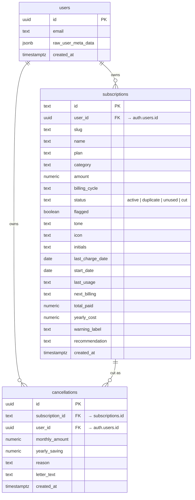

# Slash — Data Model (ERD)

The Slash backend runs on **Supabase (PostgreSQL)**. Authentication is handled by
Supabase's built-in `auth.users` table; the app owns two tables in the `public`
schema, both protected by Row Level Security so a user can only ever read or
write their own rows.


## Relationships

- `auth.users (1)` ──< `public.subscriptions (∞)` — each subscription belongs to one user.
- `auth.users (1)` ──< `public.cancellations (∞)` — each cancellation belongs to one user.
- `public.subscriptions (1)` ──< `public.cancellations (∞)` — a cancellation references the subscription that was cut.

## Mermaid source



## Row Level Security

Every policy is owner-scoped:

```sql
-- subscriptions & cancellations both use the same pattern
using (auth.uid() = user_id)        -- select / update / delete
with check (auth.uid() = user_id)   -- insert / update
```

Migrations live in [`/supabase/migrations`](../supabase/migrations):

| File | What it does |
| --- | --- |
| `0001_create_subscriptions.sql` | Initial `subscriptions` table |
| `0002_subscriptions_write_policy.sql` | (legacy) open write policy — superseded by 0003 |
| `0003_user_scoping_and_rls.sql` | Adds `user_id`, owner-only RLS |
| `0004_create_cancellations.sql` | `cancellations` ledger + owner-only RLS |
